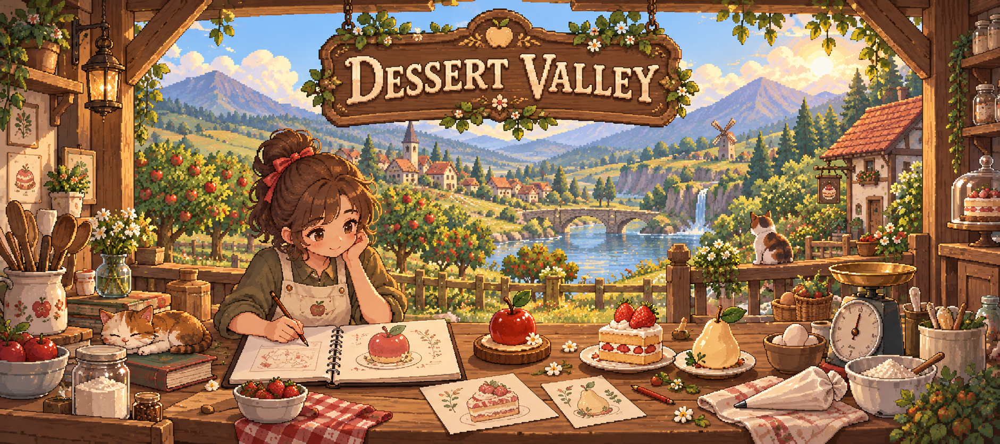
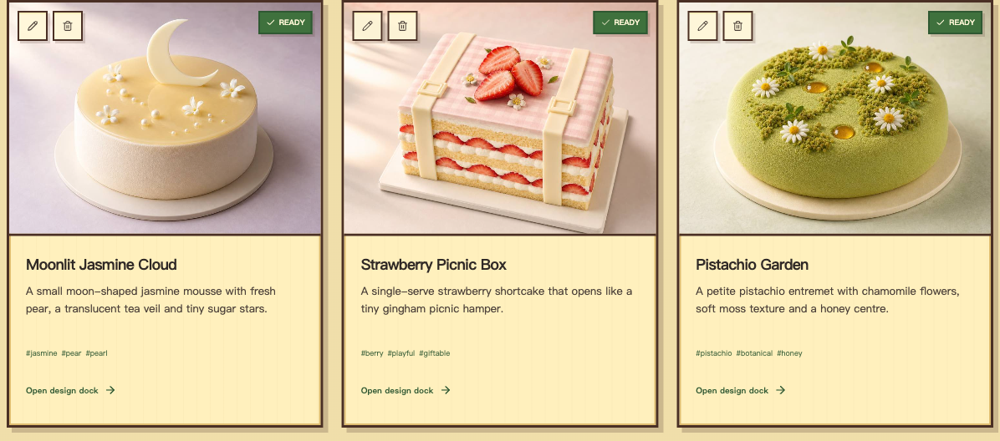
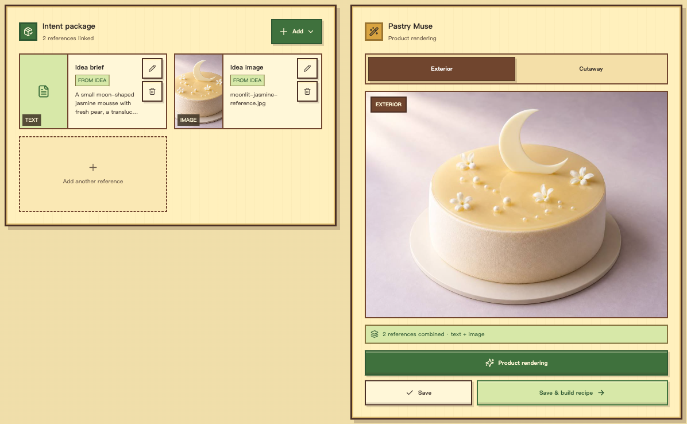
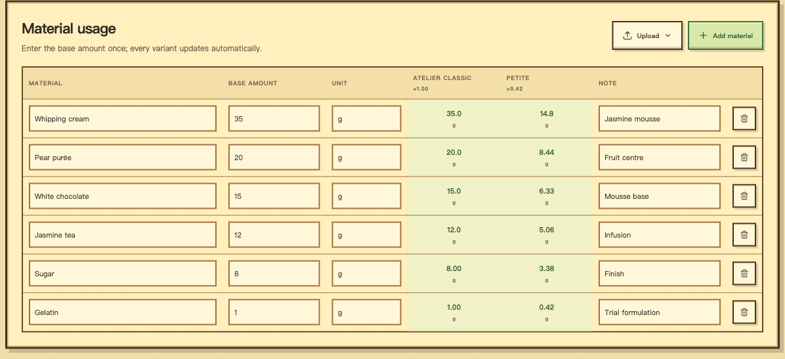
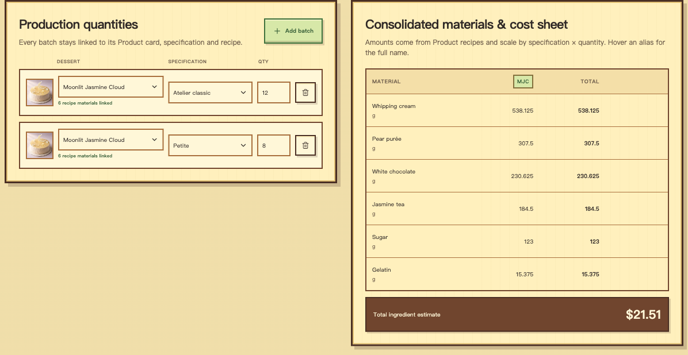
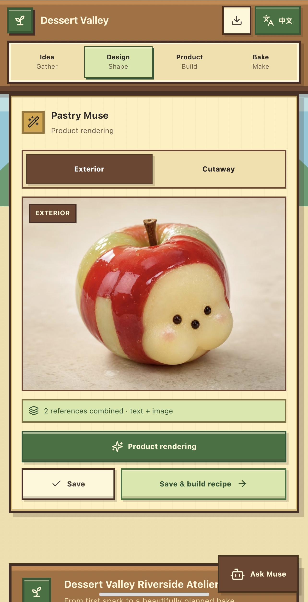
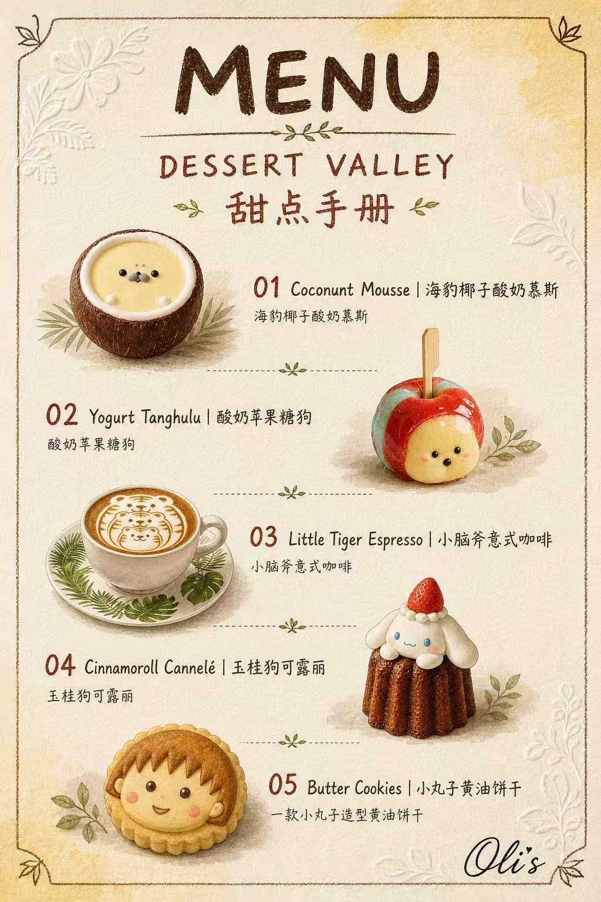

<p align="center">
  
</p>

<h1 align="center">🌷 Dessert Valley · 甜点手册</h1>
<p align="center"><strong>Dream it. Shape it. Bake a little joy.</strong><br>A cozy dessert atelier for turning a spark of inspiration into a design, a recipe, and a beautiful menu.</p>
<p align="center">🌱 Idea → 🎨 Design → 🍰 Product → 🧑‍🍳 Bake<br>✨ AI-assisted creativity · 🌏 English / 中文 · 💾 Local-first workspace</p>
<p align="center">
  <a href="https://github.com/LIU-Yinyi/Dessert-Valley/tree/openai">☁️ OpenAI Sites edition</a> ·
  <a href="https://github.com/LIU-Yinyi/Dessert-Valley/tree/vps">🏡 VPS edition</a> ·
  <a href="#quick-start">🚀 Quick setup</a> ·
  <a href="#quick-manual">🧑‍🍳 Quick manual</a>
</p>

> ☁️ **You’re on `openai` — the OpenAI Sites edition.** The site owner binds the OpenAI key on the server. Looking to run your own static site or VPS? [Switch to `vps` →](https://github.com/LIU-Yinyi/Dessert-Valley/tree/vps)

<a id="quick-start"></a>

## 🚀 Quick setup

**Using an existing site?** Open its link and start with **Idea**. The owner supplies the OpenAI connection; visitors do not enter an API key.

**Setting up your own site?** Bind `OPENAI_API_KEY` as a **server-side secret** in OpenAI Sites, then publish this branch through the Sites workflow. Keep the key out of browser code and source control. [Sites configuration and deployment details →](docs/DEVELOP.md#openai-sites-setup)

To try the project locally, install **Node.js ≥ 22.13.0** and run:

```bash
git clone --branch openai https://github.com/LIU-Yinyi/Dessert-Valley.git
cd Dessert-Valley
npm ci
npm run dev
```

Supply the local server’s `OPENAI_API_KEY` through its environment or an ignored `.dev.vars` file to enable AI features.

<a id="quick-manual"></a>

## 🧑‍🍳 Your first dessert · quick manual

1. **🌱 Idea — catch a spark.** Write a dessert brief or record a voice note. Attach up to four reference images, then choose **Add to gallery**. Review the suggested name, description, and tags.
2. **🎨 Design — shape the look.** Open a card’s **Design Dock**. Combine its brief with text, images, or canvas sketches, choose **Exterior** or **Cutaway**, and select **Product rendering**. Save a result you like, or choose **Save & build recipe** to continue.
3. **🍰 Product — build the recipe.** Add optional size variants, enter or import materials, and organize making steps with images. Variant quantities update from the base amounts; units can be weights, pieces, bars, or your own labels.
4. **🧑‍🍳 Bake — plan & serve.** In **For chefs**, add batches, choose sizes and quantities, and enter ingredient prices. In **For diners**, select desserts, set the handbook style and page count, then generate and export your menu as images, HTML, or print/PDF.

### 🖼️ The workflow at a glance

<table>
  <tr>
    <td width="50%"><strong>🌱 01 · Idea — gather</strong><p>Collect a direction and browse your dessert garden.</p><a href="docs/readme/stage-idea.png"></a></td>
    <td width="50%"><strong>🎨 02 · Design — shape</strong><p>Bring references together and explore a product rendering.</p><a href="docs/readme/stage-design.png"></a></td>
  </tr>
  <tr>
    <td><strong>🍰 03 · Product — build</strong><p>Turn the design into materials and scaled size variants.</p><a href="docs/readme/stage-product.png"></a></td>
    <td><strong>🧑‍🍳 04 · Bake — make</strong><p>Plan batches and consolidate ingredients for bake day.</p><a href="docs/readme/stage-bake.png"></a></td>
  </tr>
</table>

<sub>Selected-area browser captures of an illustrative workspace using the bundled sample artwork. Quantities are demonstration data, not a tested recipe. Click a panel to inspect it at full size.</sub>

## 🍎 From a little idea to Oli’s dessert table

A glossy **Yogurt Tanghulu · 酸奶苹果糖葫芦** becomes the star of a warm, illustrated dessert menu. These two examples were supplied by **Oli** — the design on the left, the finished menu on the right. Thank you, Oli! 💛

<table>
  <tr>
    <td align="center" width="50%"><strong>🎨 The dessert design</strong></td>
    <td align="center" width="50%"><strong>📜 The dessert menu</strong></td>
  </tr>
  <tr>
    <td align="center"><a href="docs/readme/oli-yogurt-tanghulu.jpg"></a></td>
    <td align="center"><a href="docs/readme/oli-menu.jpg"></a></td>
  </tr>
  <tr><td align="center" colspan="2"><sub>Design &amp; menu examples: <strong>Oli</strong>. Click either image for the full view.</sub></td></tr>
</table>

You can also explore these examples in the app’s **🖼️ Masterpiece gallery**: zoom, pan, and compare them side by side on a wide screen, or swipe between them on mobile.

## 🧺 Everyday tools

- **💬 Ask Muse** for help at any stage. It uses your current brief and curated references, offers suggestions, and leaves your workspace in your control.
- **🌏 English / 中文** switches the whole interface using the language button in the navigation.
- **💾 Export / Import** saves and restores workspace JSON. Your notebook is stored in this browser, so export a backup before clearing browser data or moving to another device.
- **🔐 Your connection** is used when you request AI help. Relevant inputs go to the configured provider. On VPS, your key stays in this tab’s `sessionStorage` and is excluded from workspace exports; it remains accessible to browser scripts, so use only a connection you trust.

## 🏡 Choose your edition

Both branches share the same dessert workflow, bilingual interface, Muse, gallery, and notebook tools.

| | ☁️ OpenAI Sites · `openai` | 🏡 Self-hosted · `vps` |
| :-- | :-- | :-- |
| **Where it runs** | OpenAI Sites | Your VPS or another static host |
| **Who supplies the key** | The site owner binds it as a server secret | Each user enters a compatible API connection |
| **What visitors do** | Open the site and start creating | Click **🔑 at the top-left**, save the connection, then start creating |

## 🌾 Docs & credits

- 🛠️ [Developer guide](docs/DEVELOP.md) — architecture, tests, deployment, and key handling
- 🎨 [Design style](docs/DESIGN_STYLE.md) — the original riverside atelier visual system
- 🖼️ Dessert design and menu examples: **Oli**
- ✨ Cover: original artwork generated with **GPT Image**. [Artwork credits & generation prompt →](docs/readme/ARTWORK.md)

<p align="center">🌷 Made for small ideas, beautiful desserts, and the joy of making things.</p>
